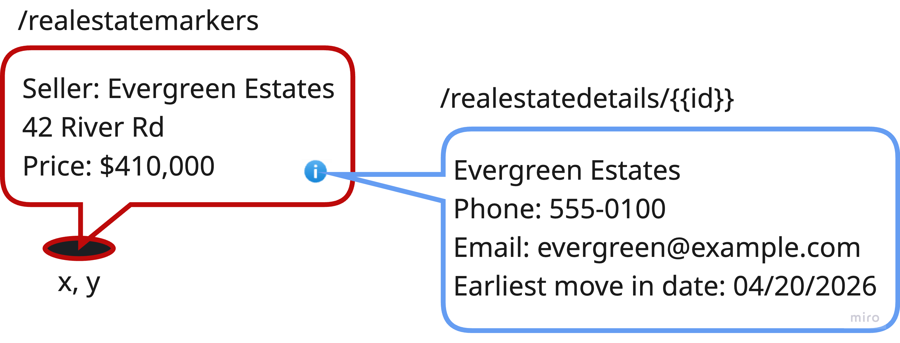

# Moving past the Hexagon: Vertical Slice Architecture

<a href="https://miro.com/app/board/uXjVLPACwgk=/?moveToWidget=3458764639806936884&cot=14" target="_blank">Miro</a>

----
# Exercise 
> Exercise branch: **8-add-salutation**
> Solution branch: **9-vertical-slice-architecture**

- Add two new use cases (view-formatted):
  - GET realestatemarkers (for maps), 
  - GET realestatedetails/{{id}}
  
- Add a new GET endpoint to the checker.http (or create a new .http file for the GETs)
- Format the response so that it looks exactly like the image on the next page
- Refactor as far as you think makes sense with your current knowledge
  - e.g. create a shared domain package used by all the use cases 
- Of course, you can use ChatGPT or other AI tools for the creation.

----
# How it should look like 

<p align="center">
  
</p>

----
# Possible response format

```json
{
  "detailsText": "Evergreen Estates<br/>Phone: 555-0500<br/>Email: evergreen@example.com<br/>Earliest move-in date: 09/29/2025"
}
```
```json
[
  {
    "id": 5,
    "location": {
      "x": -2.0,
      "y": -3.0
    },
    "markerText": "Seller: Evergreen Estates<br/>42 River Rd<br/>Price: $410,000.00"
  },
  {
    "id": 2,
    ...
  }
]
```
