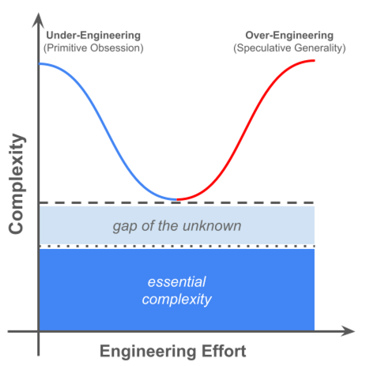

# Good Code vs. Bad Code

---
# What makes code good or bad for you?

---
# Good code minimises costs (time, money, resources)

---
# Accidental vs Essential Complexity

---

# Essential Complexity
- **Definition**: Inherent complexity of the **problem domain**
- Cannot be removed - you must deal with it
- Comes directly from **business rules or requirements**

**Examples**:
- Banking system: interest calculation, regulatory rules
- Compiler: parsing grammar, semantic analysis

---
# Accidental (or Intentionally Added?) Complexity
- **Definition**: Complexity from the **solution/implementation**
- Not required by the problem itself
- Often caused by tools, frameworks, **poor design**, or **bored developers**

**Examples**:
- Monolithic spaghetti codebase with unclear boundaries
- Dogmatically applying the latest architectural design pattern to even the simplest problem

---
# Essential vs. Accidental Complexity

  

---
# Key Takeaway
- **Essential complexity**: unavoidable - inherent to the problem domain 
- **Accidental complexity**: avoid it as much as possible

---
# Exercise - Accidental or Essential Complexity?

Using GoF design patterns in business software

---

Ensuring architectural integrity using tools like ArchUnit

---

Using Jeff's functional Java library (he's the lead developer)

---

Using Event Sourcing to create custom views

---

Backend and Frontend of the same application are developed by different teams or subteams

---

Having an interface for every service (e.g. CustomerService implements ICustomerService)

---

Every new feature is a new micro service - no need to refactor, just rewrite it.

---

Every person in a team has a clear role and follows the established process.

 
----
 
# Conclusion

- It always depends on the context.
- Some cases or more obvious than others, but that's what the "gap of the unknown" implies.
- It can change over time.
- We need to think in trade offs instead of absolute truths.
