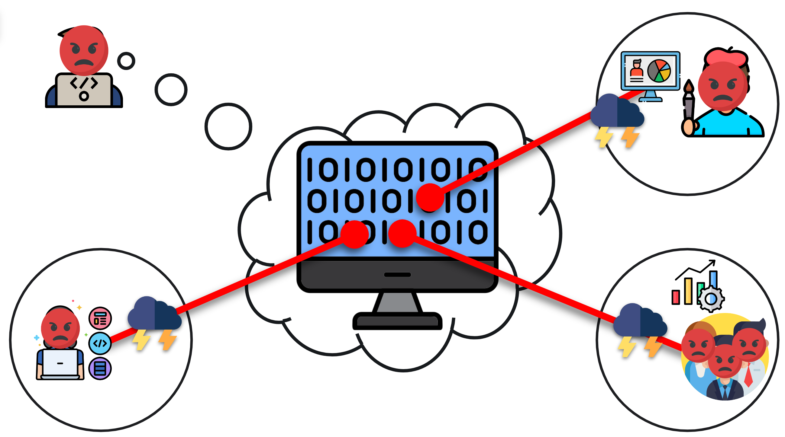
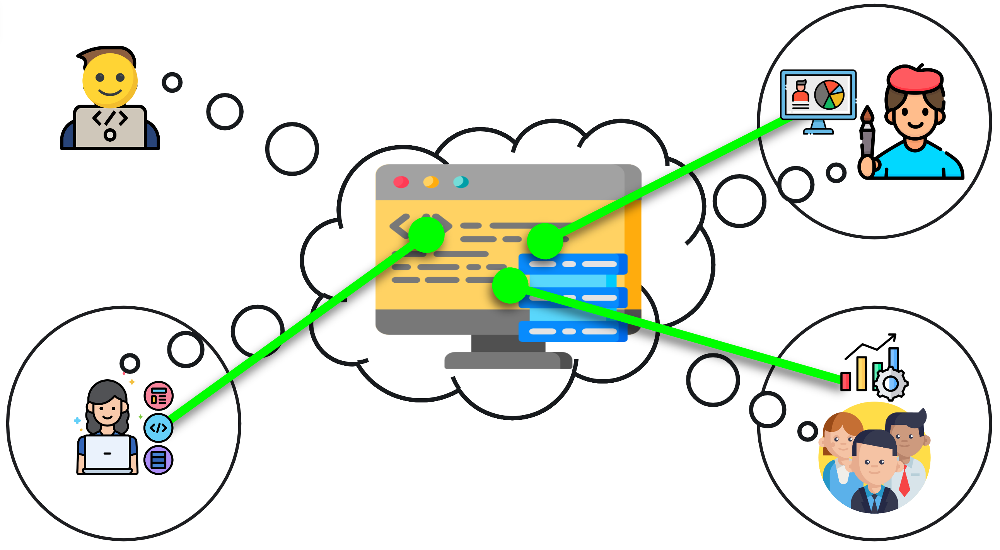

# Underengineered Code

---
<a href="https://docs.google.com/presentation/d/1FNEte0hYbxVB7COsvTxYsVOX3PESRXFFe68UU6F4b58/present?slide=id.g37c8d747cbe_0_0#slide=id.g37c8d747cbe_0_0" target="_blank">Underengineered Code</a>

---
## Underengineered, Spaghetti Code

    

- Underengineered code requires mental mapping between the outside world and code

---

## Engineering Code towards Useful Abstractions

    

- Idea: we can minimise the mental mapping between the outside world and code through human-readable abstractions.

---

## How to Improve Under-engineered Code?
* Identify anti-patterns / ["Code Smells"](https://refactoring.guru/refactoring/smells).
* Refactor them towards useful abstractions and architecture design patterns.
* This is what we will do in the first part of the course.
---

## Exercise 1
<a href="https://docs.google.com/presentation/d/1S0FbUrM-kuceHMhuurjIuup-P0oaCdorqqX4A6y_NIU/present?slide=id.g37c8d747cbe_0_0" target="_blank">Bad Names</a>
